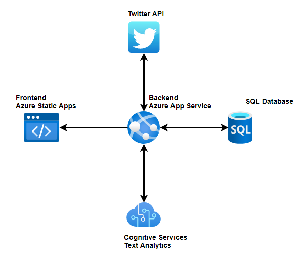

# EY_aspect_based_sentiment_analysis

## Zespół
**Kamil Kowieski**  
Bartłomiej Łukasik  
Damian Wróblewski  

## Funkcjonalności:
- Wczytywanie od użytkownika hashtgów do analizy i parametrów takich jak:  
  - Czas przechowywania wstecz  
  - Odświeżanie hashtagów ( maximum 6,5 dnia)  

- Wczytywanie tweetów z api twittera do bazy danych (7 dni wstecz)  
- Przechowywanie tweetów przez określoną przez użytkownika ilość dni  
- Analiza sentymentu na przestrzeni czasu   
- Losowanie przykładowych tweetów o różnym poziomie sentymentu dla danego hasztagu  
- Zrobienie wykresów ogólnego sentymentu i sentymentu w przedziale czasowym  
- Prezentacja wykresów dla wielu hasztagów w aplikacji webowej  
- aktualizacja bazy danych dla hasztagów na podstawie parametru odświeżania hashtagu  
- odświeżanie wykresów w aplikacji na podstawie parametru odświeżania hashtagu  

## Stos technologiczny:
- Python (Flask)  
- mysql  
- VM z systemem linux  
- Power BI  
- Azure  
- HTML, CSS, JS

## Architektura

### Harmonogram:
•	Pobieranie i przetwarzanie danych z Twitter API, baza danych - 21.12  
•	Połączenie modelu analizy sentymentu ( cognitive services sentiment text analysis ) z bazą danych - 4.01
•	Generowanie wykresów w Power BI, prezentacja wyników analizy - 14.01
•	Gotowa Aplikacja webowa  - 28.01
